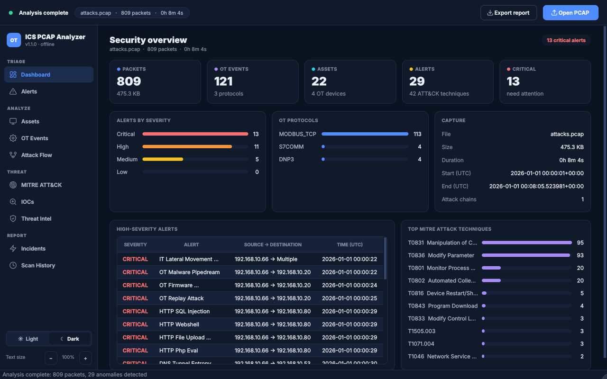
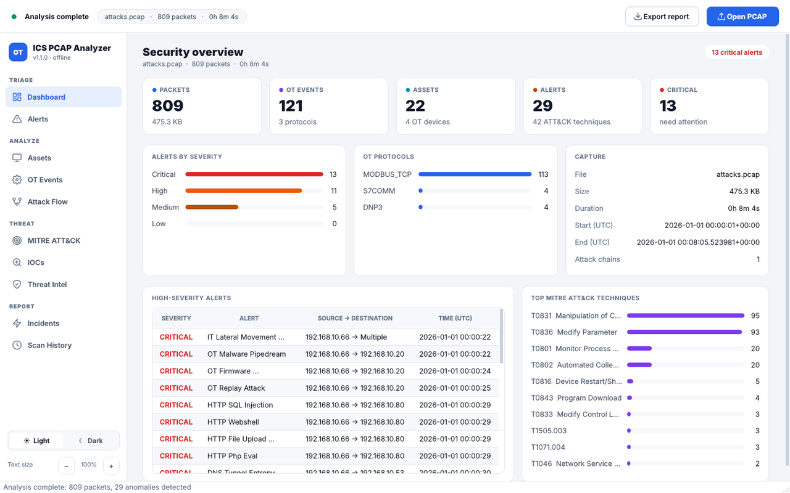
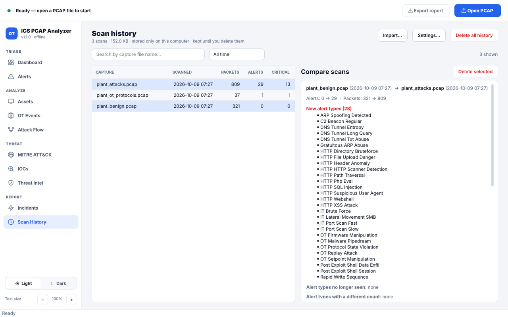

# OT PCAP Analyzer

[](https://github.com/lindseynguyen/ics-pcap-analyzer/actions/workflows/tests.yml)
[](LICENSE)

Offline analyzer for **OT/ICS network captures** (PCAP / PCAPNG). It decodes
industrial protocols, detects attacks on both the OT and IT layers, correlates
alerts into attack chains with readable storylines, and maps findings to
**MITRE ATT&CK for ICS**. It runs from the command line or a desktop GUI with
light and dark themes.



<p align="center">
  
  
</p>

<sub>Screenshots use the synthetic demo traffic from the test suite.</sub>

> **Project status: 1.0 / beta.** The detection logic is covered by an automated
> test suite built on synthetic captures. It has not yet been validated broadly
> against real plant traffic — feedback, sanitised captures and detection
> tuning are the most valuable contributions right now (see [CONTRIBUTING.md](CONTRIBUTING.md)).

## Features

**Protocol decoding** (with TCP stream reassembly of OT PDUs)

| Protocol | Port | Decoded |
|---|---|---|
| Modbus TCP / UDP | 502 | Function codes, addresses, values, exceptions, request vs. response |
| S7comm | 102 | Job / Ack-Data / Userdata, read/write, download/upload, PLC stop |
| DNP3 | 20000 | Application function codes (read, operate, restart, stop application…) |
| EtherNet/IP (CIP) | 44818 | Encapsulation commands, CIP services (tag read/write…) |
| IEC 60870-5-104 | 2404 | I/S/U frames, ASDU types, STARTDT/STOPDT |
| OPC UA | 4840 | HEL/OPN/MSG, service requests (Read, Write, Call, Browse…) |
| MQTT | 1883 | Packet types, topics |
| BACnet/IP | 47808 | BVLC/NPDU/APDU, confirmed & unconfirmed services |

Capture formats: PCAP (µs/ns, both byte orders), PCAPNG (incl. big-endian),
Ethernet, VLAN/QinQ, Linux cooked (SLL/SLL2), raw IP, IPv4 and IPv6.

**Detection**

- **OT:** rapid/mass writes, setpoint manipulation, firmware / program download,
  controller stop & restart commands, protocol state violations, replayed commands,
  behavioural signatures of ICS malware families (e.g. Industroyer, Pipedream,
  FrostyGoop), optional ML outlier scoring.
- **IT:** port scans, brute force, lateral movement (SMB/RDP), C2 beaconing,
  data exfiltration, DNS tunnelling, ARP spoofing, post-exploitation shell activity.
- **Web (HMI/SCADA front-ends):** SQL/command injection, XSS, path traversal,
  SSRF, web shells and dangerous uploads, scanners, directory brute force.
- **Behaviour profiling:** the first part of a capture is learnt as "normal", then the
  rest is checked for new masters / publishers talking to OT devices, function codes
  never used before, polling that stops or turns into a storm, and written values
  far outside the learnt range.
- **Your own rules:** YAML/JSON detection rules on OT events (protocol, operation,
  addresses/subnets, function codes, target regex, value limits, thresholds) — see
  [examples/rules](examples/rules/README.md).

**Analysis & reporting**

- Attack-chain correlation with kill-chain phases, OT escalation score and storylines
- IOC extraction (IPs, hashes, domains, URLs, MITRE techniques) → JSON / CSV
- Excel report (summary, OT events, assets, anomalies, attack chains, storylines)
- Optional threat intelligence: local feeds, VirusTotal / AbuseIPDB (your own API keys;
  private/internal IPs are never sent online)
- **Scan history** stored only on your computer: per-scan details, compare two scans
  (new / resolved alert types and IOCs), analyse a capture again, export / import,
  delete one, several or all scans, automatic clean-up after N days, or turn history off

## Installation

Python 3.10+. Use a virtual environment so the project's packages do not clash
with the ones your operating system ships (on Ubuntu, mixing `apt` and `pip`
versions of numpy/pandas causes `numpy.dtype size changed` errors).

```bash
git clone https://github.com/lindseynguyen/ics-pcap-analyzer.git
cd ics-pcap-analyzer
python3 -m venv .venv
source .venv/bin/activate            # Windows: .venv\Scripts\activate
pip install --upgrade pip
pip install -r requirements.txt      # or: pip install -e ".[gui,ml]"
```

`PyQt5` is only needed for the GUI and `scikit-learn` only for ML scoring.
Run `source .venv/bin/activate` again in every new terminal.

<details>
<summary>Ubuntu / Debian notes</summary>

```bash
sudo apt install -y python3-venv python3-pip
# if the GUI reports "Could not load the Qt platform plugin xcb":
sudo apt install -y libxcb-xinerama0 libxkbcommon-x11-0 libxcb-cursor0
```
</details>

## Usage

```bash
# GUI
python -m ot_pcap_analyzer

# Command line: analyse a capture and write an Excel report
python -m ot_pcap_analyzer --cli capture.pcap -o report.xlsx

# Command line with attack-chain correlation and storylines
python -m ot_pcap_analyzer --cli capture.pcap --advanced

# Limit the number of packets
python -m ot_pcap_analyzer --cli capture.pcap -m 100000

# Add your own detection rules (file or folder, repeatable)
python -m ot_pcap_analyzer --cli capture.pcap --rules examples/rules/example_rules.yml

# Turn behaviour profiling off
python -m ot_pcap_analyzer --cli capture.pcap --no-behavior
```

Rules placed in `~/.ot_pcap_analyzer/rules/` are loaded automatically, also by the GUI.
YAML rules need `pip install pyyaml`; JSON rules work without it.

After `pip install -e .` the same commands are available as `ot-pcap-analyzer`.

### Light / dark theme and scan history (GUI)

- Switch theme at the bottom of the sidebar (or `Ctrl+D`); text size with `−` / `+` (`Ctrl+-` / `Ctrl+=`).
- **Scan History** lists every analysis saved on this computer
  (`~/.ot_pcap_analyzer/analysis.db`). Select one scan for details, two scans to
  compare them, right-click for more actions. **Settings…** turns history off or
  deletes scans automatically after a number of days; **Delete all history**
  erases everything (deleted data is wiped from the database file, not just hidden).
- Nothing in the history is ever uploaded, and the repository never contains it.

### Python API

```python
from ot_pcap_analyzer import OTAnalyzer, AnalyzerConfig

analyzer = OTAnalyzer(AnalyzerConfig(enable_correlation=True, enable_storyline=True))
analyzer.analyze_capture("capture.pcap")

print(analyzer.get_summary()["ANOMALIES_DETECTED"])
for anomaly in analyzer.anomalies:
    print(anomaly.severity, anomaly.anomaly_type, anomaly.src_ip, "->", anomaly.dst_ip)

analyzer.export_excel("report.xlsx")
```

### Threat intelligence (optional)

Online lookups are off unless you provide keys:

```bash
export VIRUSTOTAL_API_KEY="..."
export ABUSEIPDB_API_KEY="..."
```

or `~/.ot_pcap_analyzer/api_keys.json` (`{"virustotal": "...", "abuseipdb": "..."}`).
Offline feeds are plain text files in `~/.ot_pcap_analyzer/threat_feeds/`
(`malicious_ips.txt`, `malicious_hashes.txt`, `malicious_domains.txt`; one
`value[,severity[,description]]` per line). Behind a TLS-inspecting proxy, set
`OT_ANALYZER_CA_BUNDLE` to the proxy CA bundle.

## Project layout

```
ot_pcap_analyzer/
├── main.py                  CLI / GUI entry point
├── analyzer.py              Capture pipeline: link/IP/TCP, OT dispatch, correlation, reports
├── parsers.py               PCAP/PCAPNG readers, protocol parsers, HTTP decoding
├── ot_stream.py             OT TCP stream reassembly (PDU framing)
├── detectors.py             Rule-based and ML detectors
├── detection/behavior.py    Behaviour profiling (new talkers, polling, value ranges)
├── detection/rules_engine.py  User-defined YAML/JSON detection rules
├── protocols/base.py        Shared helpers and event vocabulary for protocol decoders
├── baseline.py              Baseline learning / whitelist rules
├── ot_malware_signatures.py ICS malware behavioural signatures
├── advanced_threat_detector.py  Kill-chain threat scoring
├── storyline.py             Attack storylines
├── http_stream_analysis.py  Web shell / HTTP attack-chain analysis
├── ioc_collector.py, ioc_models.py   IOC extraction and export
├── threat_intel.py          Local feeds, VirusTotal, AbuseIPDB
├── database.py              SQLite scan history (list, compare, delete, retention)
├── constants.py             Protocol tables, detection rules, MITRE mappings
├── report_export.py, models.py, utils.py, version.py
├── gui_style.py             Theme engine: light/dark design tokens
├── gui_components.py        Cards, KPI tiles, bar lists
└── gui*.py, incident_tab.py, attack_flow_widget.py, ioc_panel.py, intel_db_panels.py   PyQt5 GUI
tests/                       pytest suite; synthetic captures generated by tests/pcap_factory.py
```

## Running the tests

```bash
pip install -r requirements-dev.txt
QT_QPA_PLATFORM=offscreen python -m pytest
```

The suite generates its own captures, so no real traffic is needed. It checks
every protocol decoder, that a realistic benign capture produces **no alerts**,
that each attack scenario is detected, and that the CLI, reports, IOC export,
history database and GUI work end to end.

## Related resources

If you analyze OT captures, you probably also audit the systems behind them. The free **[OT/ICS Security Quick Audit Checklist 2026](https://techsavant013.gumroad.com/l/ot-ics-quick-audit-checklist?utm_source=github&utm_medium=readme)** (pay what you want) gives you 35 evidence-based checks across 9 domains, mapped to IEC 62443. For full assessments, see the **[OT/ICS Cybersecurity Audit & Risk Assessment Toolkit 2026](https://techsavant013.gumroad.com/l/ot-security-toolkit?utm_source=github&utm_medium=readme)**.

## Contributing

Contributions are welcome — bug reports, new protocol parsers, detection rules,
false-positive fixes, tests and documentation. Please read
[CONTRIBUTING.md](CONTRIBUTING.md) and the [Code of Conduct](CODE_OF_CONDUCT.md).
Security issues: see [SECURITY.md](SECURITY.md).

## Disclaimer

This tool analyses recorded traffic offline; it does not send anything to the
monitored network. Detections are heuristic and can produce false positives and
false negatives — verify findings before acting on them in a production plant.

## License

[MIT](LICENSE) © OT PCAP Analyzer contributors
